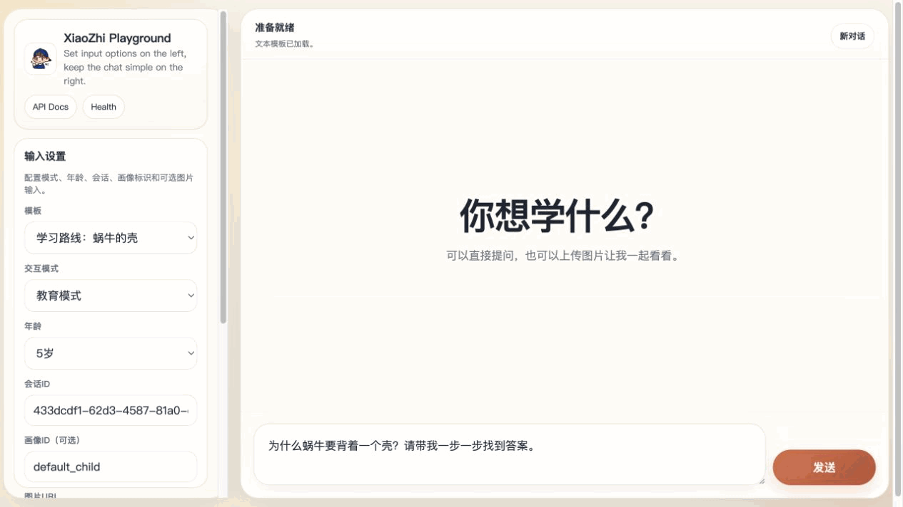
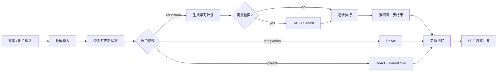
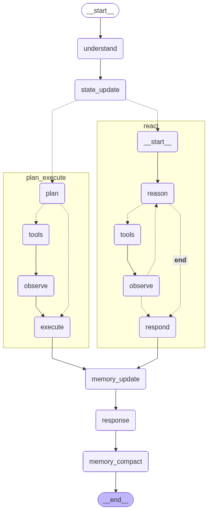

<div align="center">
  
  <h1>小智 Agent</h1>
  <p><strong>一个会因角色而改变学习方式的儿童教育与陪伴 Agent。</strong></p>
  <p>面向 3–8 岁儿童的教育引导、日常陪伴与家长辅助，基于 LangGraph、RAG 与分层记忆构建。</p>
  <p>
    <a href="#-快速开始">快速开始</a> ·
    <a href="#-三种角色三种交互方式">体验设计</a> ·
    <a href="#-工作流概览">工作流</a>
  </p>
  <p>
    
    
    
    
    
  </p>
</div>

<p align="center">
  
</p>

<p align="center"><sub>数学应用题通过同一 SSE 协议实时展示 <code>Planning → Step 1/2/3 → Verify → Complete</code>；演示使用确定性本地载荷录制，不代表线上模型的实际回答。</sub></p>

---

## 🌱 不只是回答问题，而是选择合适的陪伴方式

小智不把每一句输入都送入同一套推理流程。它会先理解输入并恢复记忆，再依据用户角色选择合适的子图：孩子学习时重视循序渐进，陪伴交流时维持自然的多轮对话，家长场景则能够从记忆中整理近期学习情况。

| 模式 | 工作流 | 体验目标 |
| --- | --- | --- |
| `education` | Plan-and-Execute | 拆解知识点、适时检索、按步骤启发式讲解。 |
| `companion` | 受控多轮 ReAct | 面向轻陪伴与日常交流，按需使用工具后继续推理。 |
| `parent` | 受控多轮 ReAct + 家长技能 | 汇总学习记忆、处理家长侧问题，并可按需联网搜索。 |

## ✨ 当前能力

| 能力 | 说明 |
| --- | --- |
| 🧭 双框架路由 | 教育模式进入 `plan → (tools?) → execute`；陪伴/家长模式进入 `reason → tools → observe → respond` 循环。 |
| 🖼️ 多模态输入 | 支持纯文本、图片 URL 与 Base64 图片；Playground 支持上传前压缩与预览。 |
| 📚 本地知识库 | 从 `KG/` 加载 `.txt` / `.pdf`，使用 FAISS 建立本地索引。 |
| 🧠 分层记忆 | 管理 `working`、`episodic`、`semantic`、`perceptual` 记忆，并支持恢复、压缩与遗忘。 |
| 🔎 可选工具 | 包含本地检索、Tavily 联网搜索、记忆读取与 `generate_parent_summary` 家长摘要技能。 |
| 🌊 流式体验 | FastAPI 通过 SSE 返回回答 `delta` 与用户安全的 workflow 事件；Playground 可见规划、检索和逐步执行状态。 |

## 🗺️ 工作流概览



教育模式会在同一条响应流中依次发送 `planning_started`、`planning_completed`、`retrieval_*`、`step_started`、`step_completed` 与 `workflow_completed`。这些事件只包含可展示的步骤标签和状态，不暴露隐藏推理；每一步的真实结果都会累积进最终回答，而不是只保留最后一步。

README 动图使用“18 块积木”应用题：先算 `18 - 6`，再算 `12 ÷ 3`，最后用 `4 × 3 + 6` 验算，让规划、执行顺序和最终结果在一个例子里完整闭环。

<details>
  <summary><strong>查看完整架构图</strong></summary>
  <br />
  <p align="center"></p>
</details>

详细设计说明：[
Graph](./docs/architecture/graph.md) ·
[RAG](./docs/architecture/rag.md) ·
[Memory](./docs/architecture/memory.md)

## 🚀 快速开始

**环境要求：** Python `3.10+`。

```bash
git clone https://github.com/yuhuping/XiaoZhi-Agent.git
cd XiaoZhi-Agent

python3 -m venv .venv
source .venv/bin/activate
pip install -r requirements.txt

cp .env.example .env
```

在 `.env` 中配置最小模型连接：

```dotenv
LLM_BASE_URL=https://your-llm-endpoint
LLM_API_KEY=your-llm-api-key
LLM_MODEL=your-text-model
```

启动服务后访问 `http://127.0.0.1:8000/`：

```bash
python -m uvicorn app.main:app --host 127.0.0.1 --port 8000 --reload
```

## ⚙️ 可选配置

| 配置 | 何时需要 |
| --- | --- |
| `vllm_base_url` / `vllm_api_key` / `vllm_model` | 启用视觉模型能力时。 |
| `TAVILY_API_KEY` / `TAVILY_BASE_URL` | 需要处理时效性问题或联网搜索时。 |
| `RAG_embedding_model_key` | 使用本地 RAG embedding 时。 |
| `LANGSMITH_TRACING` / `LANGSMITH_API_KEY` / `LANGSMITH_PROJECT` | 需要追踪工作流与调试调用链时。 |
| `MEMORY_RESET_ON_START=false` | 希望保留已有记忆库时；否则启动配置可能清空记忆。 |

默认知识库目录为 `KG/`，运行数据（记忆库与索引）由应用创建在 `data/` 下。RAG embedding 不可用时，检索会降级为空结果而不阻塞服务启动。

## 🧪 验证

```bash
pytest -q
```

测试覆盖路由决策、Plan-and-Execute、ReAct 迭代与工具相关逻辑，不调用真实模型服务。

## 🗂️ 项目结构

```text
XiaoZhi-Agent/
├── app/
│   ├── agent/       # LangGraph 状态、节点与子图路由
│   ├── api/         # FastAPI 路由与 SSE 接口
│   ├── frontend/    # 内置 Playground
│   ├── memory/      # 分层记忆系统
│   ├── rag/         # 本地知识检索与索引
│   ├── skills/      # 技能注册与家长摘要技能
│   └── tools/       # RAG、搜索与记忆工具封装
├── docs/            # 架构说明与演示素材
├── KG/              # 本地知识库语料
├── tests/           # pytest 测试
└── .env.example     # 配置模板
```

## 🔐 安全提示

不要提交真实 API Key 或记忆数据；`.env` 与运行时 `data/` 应保持在 Git 忽略范围内。
